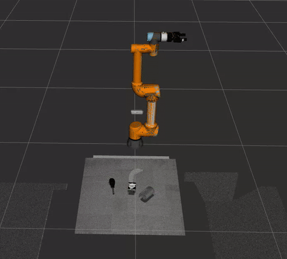

# ROS2_6DoF_grasp_pipeline


## prep sim
```bash
sudo apt install ros-humble-gazebo-ros
sudo apt install ros-humble-gazebo-ros-pkgs
sudo apt-get install ros-humble-gazebo-ros2-control
sudo apt-get install ros-humble-tf-transformations
sudo apt install ros-humble-moveit-visual-tools
```

## prep real
```bash
sudo apt-get install ros-humble-tf-transformations
sudo apt install ros-humble-moveit-visual-tools
```

## hand eye calibration
    get relationship of camera and base

## urdf
1. set a virtual tool as tcp, distance is 0.22 or other value, unit in meters, no need any physical property
   we can use tool or gripper_base as parent link

2. use hand eye calibration matrix, set position and pose of realsensed435i(or other camera)
   parent link world(eye to hand) or tool0(eye in hand)

3. set up collision matirx
   
## scene set(sim)
### is coming soon
```
1.

2.

3.
```


 # flow of sim grasping 

## start robot arm rviz
```bash
ros2 launch bringup simulation.launch.py
```
## save img
```bash
ros2 run vision save_img
```
## Real-time Grasp Pose Inference and Visualization (Optional)
``` bash
ros2 launch gnb gnb_server.launch.py
```
## grasp detect
```bash
cd graspnet
command bash_demo
```
## pub msg:result of graspnet gg
```bash
ros2 launch vision tf_pub.launch.py
```


## since we use gazebo_ros_link_attacher
we should change src/ur5e_gripper_control/config/obj_class.yaml
```
    # params.yaml
obj_grasp:
  ros__parameters:
    obj_class: "salt"   #change it banana or any other
```
 see tf, check coordinate of target obj

## execuate motion and grasp in gazebo
```bash
ros2 launch ur5e_gripper_control demo1.launch.py
```

## real should change obj_graso.cpp. we dont need attach deattach


## Acknowledgments

The grasp detection algorithm of this work is built upon the [GraspNet](https://github.com/graspnet/graspnet-baseline) project. We sincerely thank the GraspNet team and all contributors for making their excellent work open source.
